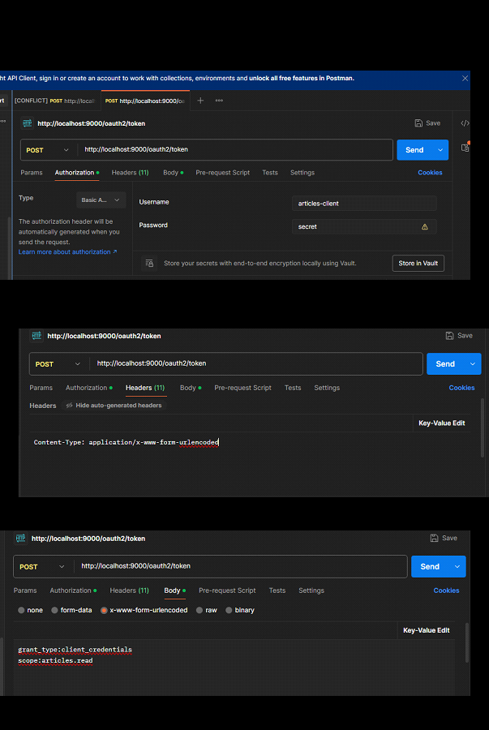

setting up the OAuthServer 
-------------------------

Learn OAuth2.0 Authorization Server With Spring boot Setup | Latest | Beginner | Tutorial
Amol kumar

https://www.youtube.com/watch?v=9oFyzXgbzwo&t=2904s

---------------------------------------------------------------------------
providing AUthorisation for the users ( Roles and Responsibilities)

OAuth 2.0 Role Based Authorization Using Spring Boot | Spring boot Security Tutorial | Part - 3
Amol kumar

https://www.youtube.com/watch?v=GsIO3R_mF0M