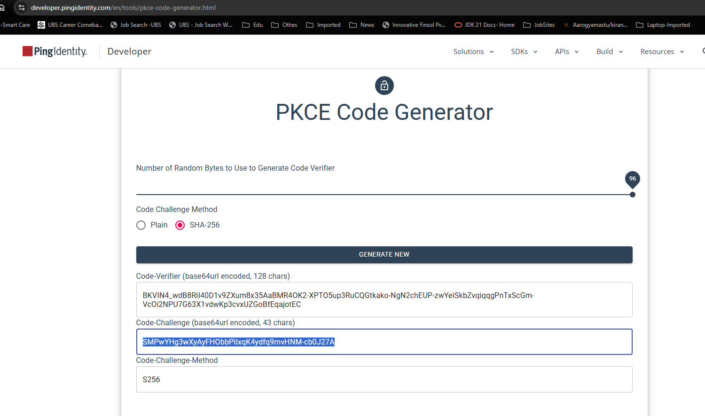
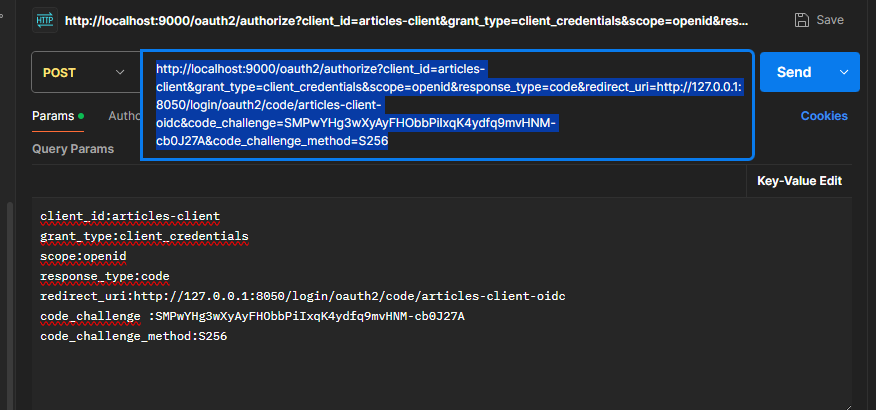
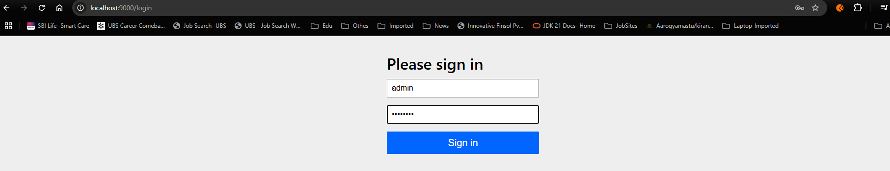
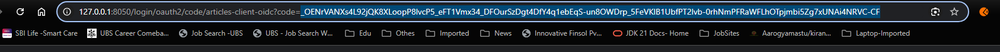
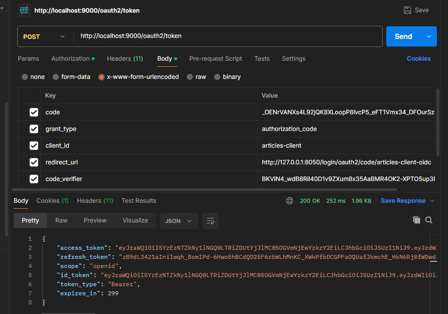
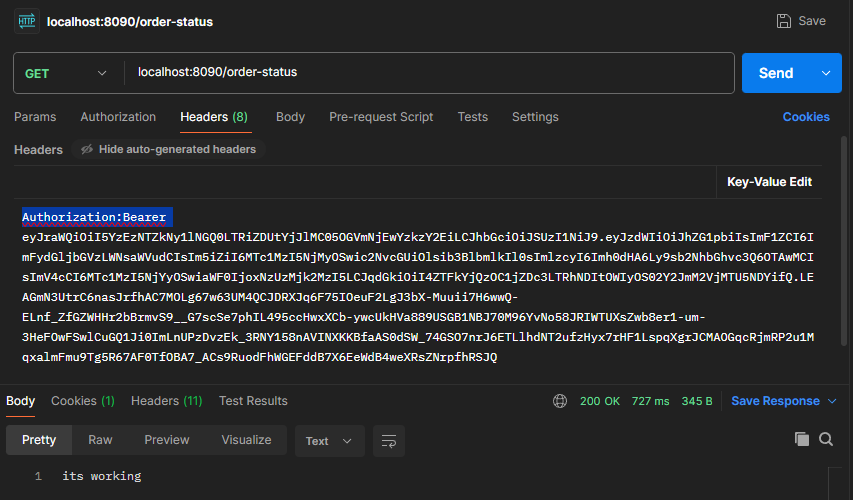

OAuth2.0 Spring boot Resource Server Security | Java | Part - 2 | Tutorial | Learn In Simple Way
Amol kumar

https://www.youtube.com/watch?v=EcPSiQPgaqo

=================================================================================

Testing Flow steps:

1) http://localhost:8090/order-status -- when you hit this Resource URL,  you will get 401
so lets start with the first step from PKCE.
Hit the below url
2) https://developer.pingidentity.com/en/tools/pkce-code-generator.html
3) 
click on 'generate new' and use the code_challenge in postman
4)  
5) http://localhost:9000/oauth2/authorize --provide some params as shown below
      client_id:articles-client
      grant_type:client_credentials
      scope:openid
      response_type:code
      redirect_uri:http://127.0.0.1:8050/login/oauth2/code/articles-client-oidc
      code_challenge :SMPwYHg3wXyAyFHObbPiIxqK4ydfq9mvHNM-cb0J27A
      code_challenge_method:S256
      use the below to generate the code_challenge & code_challenge_method

5) copy the above post request and hit the URL in browser (make sure before hitting the request the Auth Server & Resource servers should be up and running.)
6) It will redirect to login page.
7) 
8) enter the credentials and it wil redirect and gives the code in the URL
9) 
10) use the above token in the post request as shown below with additional params
11) 
12) Now use this access_token to access the REST service of the Resource server making the following entry
13) 
13) you can see the output "its working"
14) NOTE: this token will be valid for 5 mins only., so be quick to use the token